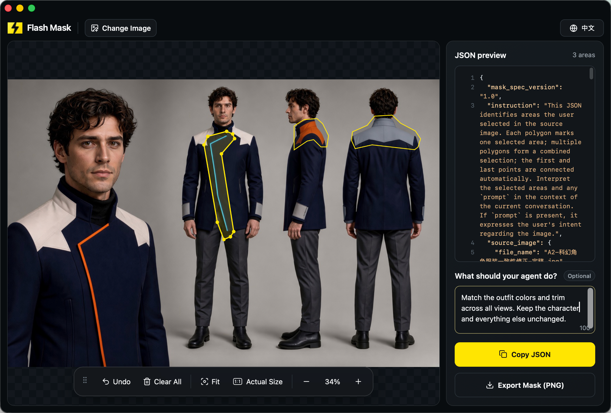

# Flash Mask

[](https://github.com/sudoHG/FlashMask/releases/latest) [](https://github.com/sudoHG/FlashMask/stargazers) [](LICENSE) [](https://apps.apple.com/jp/app/flash-mask/id6803817818?mt=12) [](https://apps.apple.com/jp/app/flash-mask/id6803817818?mt=12) [](https://hits.sh/github.com/sudoHG/FlashMask/)

[English](README.md) | [简体中文](README.zh-CN.md) | [繁體中文](README.zh-Hant.md) | 日本語 | [Deutsch](README.de.md) | [Français](README.fr.md) | [Español](README.es.md)

**AIに編集箇所を的確に伝える、すばやい画像マスク作成ツール。**

<a href="https://apps.apple.com/jp/app/flash-mask/id6803817818?mt=12"></a>

> 「そこじゃなくて、その隣。」——AI相手に何度そう言ったことでしょう。  
> ほんの少し細部を直したいだけなのに、モデルが画像全体を再生成してしまう。これまでは、高機能で重い画像編集ソフトを立ち上げ、面倒な選択と書き出しを行うしかありませんでした。  
> Flash Maskなら、その作業をわずか数秒で完結できます。画像をドロップし、変更したい領域を囲んで、構造化されたJSON座標をAIやエージェントに直接コピーするだけで、正確な編集位置を伝えられます。ピクセル単位の精度が必要な場合は、1クリックで1:1の白黒マスクを書き出すことも可能です。



---

## 概要

Flash Maskは、AI画像編集やビジュアルワークフロー向けに構築された、軽量なネイティブmacOSコンパニオンアプリです。AIモデルやコーディングエージェントと協調作業を行う際、テキストプロンプトだけでは正確な境界を指定できず、画像全体が意図せず変更されたり、誤った場所が編集されたりすることがよくあります。

macOS版のFlash Maskは、画像全体の指示と個別の領域に対する任意のメモを含めたJSON 1.1を出力します。WebサイトのWebアプリ版はJSON 1.0のままとなります。

### Macアプリ

- クリップボードからスクリーンショットを直接貼り付け可能。
- 画像全体への1つの指示と、個別領域への任意のメモを追加可能。
- 7言語（英語、簡体字中国語、繁体字中国語、日本語、ドイツ語、フランス語、スペイン語）のインターフェースに対応。
- 専用の設定ウィンドウで、言語の切り替え、アップデートの確認、Webサイト、ヘルプ、GitHubソース、サポートページの表示が可能。

複雑な画像編集ソフトでなげなわツールや塗りつぶしレイヤー、手動での書き出しに苦労する代わりに、Flash Maskなら選択範囲をわずか数秒でエージェントがそのまま使える座標へと変換します：

- **デフォルトで構造化JSON座標を出力**: ピクセル座標、正規化座標、元画像の寸法、ローカルの絶対ファイルパス、および任意の編集指示（prompt）を含む標準化されたJSONを1クリックでコピーできます。AIチャットやエージェントのワークフローにそのまま貼り付け可能です。
- **必要に応じて1:1の白黒PNGマスクを出力**: ピクセル単位のマスクを必要とするインペインティングモデルや従来のパイプライン向けに、元画像の寸法と一致する鮮明なPNGマスクを書き出せます（選択範囲は純白、背景は純黒、ぼかしやアンチエイリアスなし）。
- **100%ローカル、オフライン、プライベート**: 画像のデコード、座標計算、マスクのレンダリングはすべてお使いのMac上で実行されます。画像、ファイルパス、座標、プロンプトが外部にアップロードされることは一切ありません。アカウント登録やサインインは不要で、広告やトラッキングSDKも含まれていません。
- **空間指定に特化——組み込みAIによるロックインなし**: Flash Maskは、「*どこを編集するか*」と「*何を変更するか*」を明確に伝えることに特化しています。実際の画像生成や編集はお好みのAIツールやエージェント側で行うため、ベンダーロックインやクラウド依存はありません。

## 主なユースケース

- **キャラクターイラストやAI生成画像のレタッチ**: 手、顔のパーツ、衣服、アクセサリーなどを囲み、画像の他の部分を保持したまま的確なインペインティングを指示。
- **写真のクリーンアップと不要物の除去**: 背景の通行人、不要物、透かし（ウォーターマーク）、傷などを素早く囲み、画像編集エージェントに綺麗に除去・インペイントを依頼。
- **ポスターやマーケティング素材の編集**: ポスター、バナー、EC向け素材において、差し替えが必要な特定のテキスト配置、商品被写体、グラフィック要素を指定。
- **コーディングエージェントへのUIバグ報告**: iOSシミュレータ、macOSアプリ、Canvas、WebGL、マップ、グラフ、ゲームUIなどのスクリーンショット内で、テキストの欠け、コントロールの重なり、レイアウトの崩れといった視覚的バグをピンポイントで指定し、正確な座標と修正指示の両方をコーディングエージェントに直接連携。

## クイックスタート

1. **画像を開く**: PNG、JPEG/JPG、またはWebP画像をウィンドウにドラッグ＆ドロップするか、**画像を開く**をクリックするか、クリップボードからスクリーンショットを貼り付けます。パン、ズーム、**全体表示**と**原寸大**（1:1ピクセル）表示の切り替えが可能です。
2. **領域のアウトラインと調整**:
   - 画像上をクリック＆ドラッグしてフリーハンドで領域を囲み、マウスボタンを離して追加します。必要に応じて複数の個別領域を描画できます（自動的に結合/unionされます）。
   - 既存の領域をクリックして微調整: 選択範囲全体をドラッグして位置を移動したり、多角形の個々の頂点をドラッグ、追加、削除したりできます。
   - 任意: 「**Agentへの指示**」欄に画像全体の指示を入力し、領域を選択してその領域用のメモを追加できます。
3. **JSONのコピーまたはマスクの書き出し**:
   - **JSONをコピー**をクリック: ローカルファイルパス、画像の寸法、多角形の座標、編集プロンプトを含む構造化データをクリップボードにコピーし、AIやエージェントに直接貼り付けられます。
   - **マスクPNGを書き出し**をクリック: macOSの保存シートが開き、元画像の寸法に合わせた鮮明な白黒PNGマスクを書き出します。マスクには選択領域が反映され、メモはJSONに含まれます。

## JSON座標データフォーマット

Flash Maskは、絶対ピクセル座標と正規化された`[0.0, 1.0]`座標（左上原点、X軸は右方向、Y軸は下方向に増加）のデュアル座標系を備えた、バージョン管理された自己記述型JSONを出力します。MacアプリはJSON 1.1を使用し、WebサイトのWebアプリ版はJSON 1.0を使用します：

```json
{
  "mask_spec_version": "1.1",
  "instruction": "This JSON identifies areas the user selected in the source image. Each polygon marks one selected area; multiple polygons form a combined selection; the first and last points are connected automatically. The top-level `prompt`, if present, applies to the whole image. Each region's `prompt`, if present, applies only to that region. Interpret these texts in the context of the current conversation. The combined geometry marks range only; it does not assign a processing order among regions.",
  "source_image": {
    "file_name": "example.jpg",
    "width": 1920,
    "height": 1080,
    "file_path": "/Users/username/Pictures/example.jpg"
  },
  "coordinate_system": {
    "origin": "top-left",
    "x_direction": "right",
    "y_direction": "down"
  },
  "prompt": "Keep the building",
  "regions": [
    {
      "id": 1,
      "shape": "polygon",
      "points_px": [[96, 108], [480, 108], [480, 432], [96, 432]],
      "points_normalized": [[0.05, 0.1], [0.25, 0.1], [0.25, 0.4], [0.05, 0.4]],
      "prompt": "Remove stray lines"
    },
    {
      "id": 3,
      "shape": "polygon",
      "points_px": [[600, 108], [900, 108], [900, 432], [600, 432]],
      "points_normalized": [[0.3125, 0.1], [0.46875, 0.1], [0.46875, 0.4], [0.3125, 0.4]],
      "prompt": "Use a light gray background"
    }
  ]
}
```

### フィールドリファレンス

- `mask_spec_version`: 仕様バージョン。Macアプリは現在`"1.1"`を出力し、WebサイトのWebアプリ版は`"1.0"`のままとなります。
- `instruction`: 下流のAIモデルやエージェントに対し、ポリゴンやユーザーの意図をどのように解釈すべきかを指示する、埋め込みの自己記述型ガイダンス。
- `source_image`: ソースファイル名、ピクセル寸法（`width`、`height`）、およびMacローカルの絶対ファイルパス（`file_path`はローカルのエージェントがファイルに直接アクセスできるようにmacOSアプリ専用で付与されます）。
- `coordinate_system`: 座標系の定義（左上原点、X軸は右方向、Y軸は下方向に増加で固定）。
- `prompt`: 任意。Mac版JSON 1.1では、この指示は画像全体に適用されます。
- `regions`: マークされた領域のリスト。各領域には整数のピクセル座標（`[x, y]`形式の`points_px`）と無次元の正規化座標（`[x/width, y/height]`形式の`points_normalized`）が含まれます。Mac版JSON 1.1では特定領域向けの任意の`prompt`を含めることができます。他の領域が削除されても領域IDは保持されます。始点と終点の頂点は自動的に閉じられ、複数の領域は結合（union）されます。

厳格なJSON 1.0パーサーを使用している場合は、JSON 1.1を受け入れる前にバリデータをアップグレードする必要があります。Flash Maskが領域のメモを勝手に破棄することはありません。

## 機能

- **幅広いフォーマット対応**: PNG、JPEG/JPG、WebP画像のインポートに対応。
- **複数領域の選択**: 1枚の画像上に複数の不規則な選択範囲を描画可能。書き出し時に自動的に結合マスクとして統合されます。
- **インタラクティブな頂点編集**: 選択範囲全体をドラッグして位置を移動したり、多角形の頂点を高精度に追加、移動、削除したりできます。
- **スムーズなキャンバス操作**: パンやズームが滑らかに行え、**全体表示**と**原寸大**（1:1ピクセル）表示を素早く切り替え可能。
- **画像と領域のメモ**: Macアプリでは、画像全体への任意の指示の添付や、個別領域へのメモ追加が可能。
- **デュアル座標系**: 絶対ピクセル座標と解像度に依存しない正規化座標の両方を生成し、さまざまなエージェントやモデルのスキーマに対応。
- **元解像度の忠実性**: 白黒PNGマスクは元画像の寸法と1:1で一致し、純白の選択範囲、純黒の背景、ぼかしのないくっきりとしたエッジでレンダリングされます。
- **ローカルファイルパスの直接出力**: macOSアプリは検証済みの絶対ファイルパスをJSONに出力するため、ローカルの自動化スクリプトやエージェントがファイルを即座に特定できます。
- **7つのインターフェース言語**: 英語、簡体字中国語、繁体字中国語、日本語、ドイツ語、フランス語、スペイン語。デフォルトでシステム言語に従いますが、現在の画像、領域、メモを失うことなく、トップバーの言語メニューや設定からいつでも切り替え可能です。
- **プライバシー＆オフラインファースト**: サインイン不要で100%ローカル動作し、広告やトラッキング・アナリティクスSDKは一切含まれません。

## Flash Maskの入手方法

- **Mac App Store**: [Mac App Store](https://apps.apple.com/jp/app/flash-mask/id6803817818?mt=12)から公式ビルド済みアプリを入手できます。買い切りで永続利用可能——サブスクリプションやアプリ内課金はありません。
- **公式サイト**: 製品のアップデートや詳細については [flashmask.net](https://flashmask.net/) をご覧ください。
- **ソースリリース**: [GitHub Releases](https://github.com/sudoHG/FlashMask/releases) からソースコードのアーカイブをダウンロードできます。*(注: 公式バイナリビルドはMac App Store経由でのみ配布されており、GitHub Releasesにはビルド済みバイナリは添付されません)。*

## オープンソースの範囲

本リポジトリは、以下を含むFlash Mask macOSクライアントの完全なオープンソースコードを提供します：
- ネイティブmacOS AppKit / WKWebViewホストラッパーおよびXcodeプロジェクト（`macos/`）
- 組み込みHTML / JavaScriptエディタコア（`index.html`）
- 座標規約プロトコル解析、選択頂点クリーニング、マスク生成ロジック（`src/`）
- Flash Mask 1.0および1.1 JSON Coordinate Contract検証スキーマ（`schemas/`）
- コア自動規約テストおよびユニットテストスイート（`tests/`）

*注: 本リポジトリにはスタンドアロンのmacOSアプリケーションとその編集コアが含まれています。スタンドアロンのWebデプロイスクリプトや商用バックエンドサービス（マーケティング用ランディングページ、クォータ/広告システム、アナリティクス、ホスト型インフラなど）は含まれていません。Apache-2.0ライセンスに基づき、コア編集モジュールおよび共有データ規約は自由に移植・改変して利用できます。*

## コントリビューション

ローカルでのチェック、CIカバレッジ、プルリクエストの詳細については、[コントリビューションガイド](贡献指南.md)を参照してください。

## ソースコードからMacアプリをビルドする

### 前提条件

- **Xcode**が完全にインストールされたMac（ホストmacOSのバージョンはそのXcodeリリースでサポートされている必要があります）
- 本アプリは**macOS 13.0以降**を対象とし、ユニバーサルバイナリ（`arm64` + `x86_64`）としてビルドされます
- 純粋なSwift、AppKit、WebKitによるビルド——外部Swiftパッケージへの依存はゼロです

### ビルドコマンド

リポジトリのルートから次のコマンドを実行します：

```sh
xcodebuild \
  -project 'macos/Flash Mask.xcodeproj' \
  -scheme 'Flash Mask' \
  -configuration Release \
  -derivedDataPath '.derivedData/local' \
  ONLY_ACTIVE_ARCH=NO \
  CODE_SIGNING_ALLOWED=NO \
  build
```

**ビルド出力先**: `.derivedData/local/Build/Products/Release/Flash Mask.app`

このコマンドは未署名のローカルビルドを作成し、ネイティブラッパーをコンパイルして`index.html`およびアプリケーションリソースをスタンドアロンアプリとしてバンドルします。Release構成はmacOS 13.0をターゲットにし、`arm64`と`x86_64`の両方のスライスをビルドします。公式のApp Storeビルドは、このローカルビルドコマンドではなく、個別のXcode Archiveおよび配布ワークフローを通じて作成されます。

### ワンコマンドビルドスクリプト

または、付属の`build.sh`スクリプトを使用することもできます（詳細は`./build.sh --help`を実行）：

```sh
./build.sh
./build.sh --version 1.3.1 --build-number 9 --dmg
```

スクリプトのデフォルトはバージョン`1.3`、ビルド`8`です。`--version`と`--build-number`でこれらの値を上書きできます。ビルドされたアプリのバージョン、最小macOSバージョン、および両方のアーキテクチャスライスがチェックされます。`--dmg`はローカルテスト用にその未署名アプリをパッケージ化します。生成されたDMGはGatekeeper配布には適していません。

Mac App Store外で配布する場合は、独自の**Developer ID Application** IDとセキュアタイムスタンプでアプリに署名し、コード署名を検証し、公証（Notarization）に提出して、承認されたチケットをステープルして検証します。その後、そのアプリを次のようにパッケージ化します：

```sh
./build.sh --package-app "/path/to/stapled/Flash Mask.app"
```

`--package-app`は、Developer ID署名、セキュアタイムスタンプ、公証チケット、macOS 13.0以上の要件、および両方のアーキテクチャスライスを検証し、`xcodebuild`の再実行や再署名を行うことなくバージョン付きDMGを作成します。DMG自体は未署名のままです。直接配布用にその外側コンテナの署名、公証、ステープルを行うのは個別の手順となります。このヘルパーは署名、公証、アーカイブ、または公式App Storeビルドの生成は行いません。派生ビルドでは、独自のBundle ID、アプリ名、ブランドアセットを使用する必要があります。

## コアテストの実行

コアプロトコルおよびロジックのテストスイートを実行するには、**Node.js 22**以降が必要です。(*Node.jsは規約とアルゴリズムのテストにのみ使用されます。macOSアプリ自体のビルドにはNode.jsは不要です*)。

```sh
npm ci --ignore-scripts
npm test
```

テストスイートの対象範囲：
- macOSおよびWebターゲット向けのJSON Coordinate Contractスキーマ検証
- プラットフォーム固有のフィールド制約と除外ルール
- 多角形の幾何計算およびなげなわ頂点の簡略化（平滑化および冗長性の除去）
- 1:1白黒PNGマスクのピクセルラスタライズ精度
- パフォーマンス境界および頂点数上限セーフガード
- ローカライズリソース: 7言語すべてにおけるキーの一致、プレースホルダー、ペアとなるバンドルリソース

macOS環境では、`npm test`はネイティブSwiftテスト（ローカライズリソースと設定ウィンドウの配置）もコンパイルして実行します。この際、テストウィンドウが一瞬開きます。ネイティブインターフェーステストを個別に実行するには、`node --test tests/mac-localization-ui.js`を実行してください。CIではLinux上でコアテストを実行し、Apple Silicon macOS 15、Intel、macOS 14上でネイティブおよびインターフェーステストを実行します。詳細は[コントリビューションガイド](贡献指南.md)を参照してください。

## ディレクトリ構造

| パス | 説明 |
|---|---|
| `index.html` | 組み込みエディタインターフェース、キャンバス操作、UIステートマシン |
| `src/` | 座標規約の解析、マスクラスタライズ、選択頂点クリーニングのアルゴリズム |
| `src/localizations/` | 7言語すべてのインターフェーステキスト（言語ごとに1つのJSONファイル） |
| `scripts/` | ペアとなるローカライズリソースの検証およびパッケージ化を行うビルド時スクリプト |
| `schemas/` | Flash Mask 1.0および1.1 Coordinate Contractの公式JSON Schema定義 |
| `macos/` | ネイティブAppKit / WKWebViewホストラッパー、セキュリティスコープ付きファイルアクセス、Xcodeプロジェクト |
| `tests/` | ユニットテスト、規約検証スイート、テスト用フィクスチャ |

## ライセンスと特記事項

Flash Maskのオリジナルソースコードは[Apache License 2.0](LICENSE)の下でライセンスされています。ライセンスの条項に従い、商用およびプロプライエタリな派生物を含め、本ソフトウェアを自由に使用、改変、配布することができます。

- 著作権および帰属表示の通知は[NOTICE](NOTICE)に記載されています。
- サードパーティ製コンポーネントおよび依存関係は[THIRD_PARTY_NOTICES.md](THIRD_PARTY_NOTICES.md)に記載されています。
- 「Flash Mask」という名称、ロゴ、アプリアイコンなどのブランドアセットは個別の[Brand Asset Terms](BRAND_ASSETS.md)の下で保護されており、Apache-2.0ライセンスの許諾範囲外となります。
- **ユーザーデータの所有権**: Flash Maskで生成されたすべてのJSON座標データ、画像、PNGマスクは完全にユーザーに帰属し、Apache-2.0ライセンスの対象外です。
