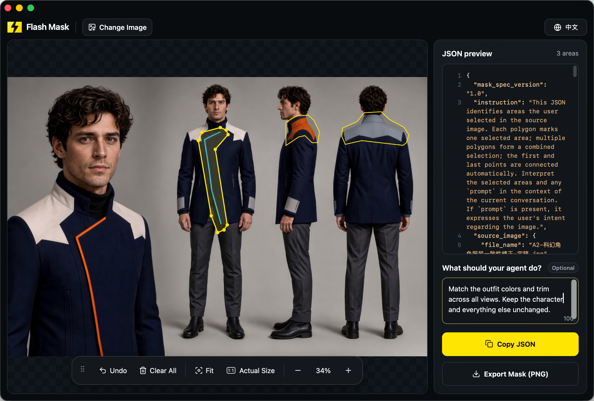

# Flash Mask

[](https://github.com/sudoHG/FlashMask/releases/latest) [](https://github.com/sudoHG/FlashMask/stargazers) [](LICENSE) [](https://apps.apple.com/us/app/flash-mask/id6803817818?mt=12) [](https://apps.apple.com/us/app/flash-mask/id6803817818?mt=12) [](https://hits.sh/github.com/sudoHG/FlashMask/)

[简体中文](README.zh-CN.md) | English

**Quick image masks that show AI exactly where to edit.**

<a href="https://apps.apple.com/us/app/flash-mask/id6803817818?mt=12"></a>

> "Not that—the one next to it." How many times have you had to say that to AI?  
> You want to tweak a single detail, and the model regenerates the entire image. Until now, fixing that meant firing up a heavyweight image editor for tedious selections and exports.  
> Flash Mask turns that whole process into seconds: drop in an image, outline the area you want changed, and copy structured JSON coordinates straight to your AI or agent so it knows the exact edit location. When you need pixel-level precision, export a 1:1 black-and-white mask with one click.



---

## Overview

Flash Mask is a lightweight, native macOS companion app built for AI image editing and visual workflows. When collaborating with AI models or coding agents, text prompts alone often fail to specify exact boundaries, resulting in unintended changes across the entire image or edits in the wrong spot.

Instead of wrestling with lasso tools, fill layers, and manual exports in complex image editors, Flash Mask converts your selections into agent-ready coordinates in seconds:

- **Structured JSON coordinates by default**: Copy standardized JSON containing pixel coordinates, normalized coordinates, source image dimensions, local absolute file paths, and optional edit instructions (prompts) with one click. Paste directly into your AI chat or agent workflow.
- **1:1 black-and-white PNG mask on demand**: For inpainting models and traditional pipelines that require pixel-level masks, export a crisp PNG mask matching original image dimensions (pure white selection, pure black background, no feathering or anti-aliasing).
- **100% local, offline, and private**: Image decoding, coordinate calculations, and mask rendering run entirely on your Mac. No images, file paths, coordinates, or prompts are ever uploaded. No accounts, no sign-ins, no ads, and no tracking SDKs.
- **Focused on spatial targeting—no built-in AI lock-in**: Flash Mask focuses on clearly communicating *where to edit* and *what to change*. The actual image generation and editing are handled by your preferred AI tool or agent—no vendor lock-in or cloud dependencies.

## Use Cases

- **Character art & AI generation touch-ups**: Outline hands, facial features, clothing, or accessories to guide targeted inpainting while keeping the rest of the image stable.
- **Photo cleanup & object removal**: Quickly box out background bystanders, clutter, watermarks, or blemishes for image-editing agents to remove and inpaint cleanly.
- **Poster & marketing asset edits**: Mark specific text layouts, product subjects, or graphic elements that need replacement in posters, banners, and e-commerce assets.
- **UI bug callouts for coding agents**: Pinpoint visual bugs in UI screenshots—such as clipped text, overlapping controls, or layout misalignments in iOS Simulator, macOS apps, Canvas, WebGL, maps, charts, or game UIs—and hand both exact coordinates and fix instructions directly to your coding agent.

## Quick Start

1. **Drop an image**: Drag and drop a PNG, JPEG/JPG, or WebP image into the window, or click **Open Image**. Pan, zoom, and toggle between **Fit** and **Actual Size** (1:1 pixel) views.
2. **Outline and refine regions**:
   - Click and drag on the image to outline a freehand area; release the mouse button to add it. Draw multiple separate regions as needed (automatically merged as a union).
   - Click any existing region to fine-tune it: drag the entire selection to reposition it, or drag, add, and delete individual polygon vertices.
   - Optional: Enter your edit instructions in the **"What should your agent do?"** field (e.g., `"Keep the mountain and remove the clouds."`).
3. **Copy JSON or export mask**:
   - Click **Copy JSON**: Copies structured data—including the local file path, image dimensions, polygon coordinates, and edit prompt—to your clipboard to paste directly into your AI or agent.
   - Click **Export Mask (PNG)**: Opens the macOS save sheet to export a crisp black-and-white PNG mask matching the source image dimensions.

## JSON Coordinate Data Format

Flash Mask outputs versioned, self-describing JSON with dual coordinate systems—absolute pixel coordinates and normalized `[0.0, 1.0]` coordinates (origin at top-left, X increasing rightward, Y increasing downward):

```json
{
  "mask_spec_version": "1.0",
  "instruction": "This JSON identifies areas the user selected in the source image. Each polygon marks one selected area; multiple polygons form a combined selection; the first and last points are connected automatically. Interpret the selected areas and any `prompt` in the context of the current conversation. If `prompt` is present, it expresses the user's intent regarding the image.",
  "source_image": {
    "file_name": "example.jpg",
    "width": 1920,
    "height": 1080,
    "file_path": "/Users/username/Pictures/example.jpg"
  },
  "coordinate_system": {
    "origin": "top-left",
    "x_direction": "right",
    "y_direction": "down"
  },
  "prompt": "Keep the mountain and remove the clouds.",
  "regions": [
    {
      "id": 1,
      "shape": "polygon",
      "points_px": [[96, 108], [480, 108], [480, 432], [96, 432]],
      "points_normalized": [[0.05, 0.1], [0.25, 0.1], [0.25, 0.4], [0.05, 0.4]]
    }
  ]
}
```

### Field Reference

- `mask_spec_version`: Specification version (currently `"1.0"`).
- `instruction`: Embedded self-describing guidance that instructs downstream AI models or agents on how to interpret polygons and user intent.
- `source_image`: Source file name, pixel dimensions (`width`, `height`), and the absolute local Mac file path (`file_path` is specific to the macOS app so local agents can directly access the file).
- `coordinate_system`: Coordinate system definition (fixed at top-left origin, X increasing rightward, Y increasing downward).
- `prompt`: Optional. Task-level user instructions for the current image.
- `regions`: List of marked regions. Each region includes integer pixel coordinates (`points_px` as `[x, y]`) and dimensionless normalized coordinates (`points_normalized` as `[x/width, y/height]`). Start and end vertices close automatically, and multiple regions form a combined union.

## Features

- **Broad Format Support**: Import PNG, JPEG/JPG, and WebP images.
- **Multi-Region Selection**: Draw multiple irregular selections on a single image; selections automatically combine into a unified mask upon export.
- **Interactive Vertex Editing**: Drag entire selections to reposition them, or precisely add, move, and remove polygon vertices.
- **Smooth Canvas Navigation**: Pan and zoom smoothly, with quick toggles for **Fit** and **Actual Size** (1:1 pixel) views.
- **Task-Level Prompts**: Attach optional text instructions to clarify your intent for the marked regions.
- **Dual Coordinate Systems**: Generates both absolute pixel coordinates and resolution-independent normalized coordinates to support varied agent and model schemas.
- **Original Resolution Fidelity**: Black-and-white PNG masks match source image dimensions 1:1, rendered with pure white selections, pure black backgrounds, and crisp, unfeathered edges.
- **Direct Local File Paths**: The macOS app outputs verified absolute file paths in JSON so local automation scripts and agents can locate files instantly.
- **Bilingual Interface**: Seamlessly switch between full English and Chinese interfaces with one click.
- **Privacy & Offline First**: Runs 100% locally with no sign-in required, zero ads, and no tracking or analytics SDKs.

## Getting Flash Mask

- **Mac App Store**: Get the official pre-built app on the [Mac App Store](https://apps.apple.com/us/app/flash-mask/id6803817818?mt=12). A one-time purchase with lifetime access—no subscriptions and no in-app purchases.
- **Official Website**: Visit [flashmask.net](https://flashmask.net/) for product updates and details.
- **Source Releases**: Download source code archives from [GitHub Releases](https://github.com/sudoHG/FlashMask/releases/tag/v1.0.0). *(Note: Official binary builds are distributed exclusively through the Mac App Store; GitHub Releases does not attach pre-built binaries).*

## Open Source Scope

This repository provides the complete open-source code for the Flash Mask macOS client, including:
- Native macOS AppKit / WKWebView host wrapper and Xcode project (`macos/`)
- Embedded HTML / JavaScript editor core (`index.html`)
- Coordinate contract protocol parsing, selection vertex cleaning, and mask generation logic (`src/`)
- Flash Mask 1.0 JSON Coordinate Contract validation schemas (`schemas/`)
- Core automated contract and unit test suite (`tests/`)

*Note: This repository contains the standalone macOS application and its editing core. It does not include standalone web deployment scripts or commercial backend services (such as marketing landing pages, quota/ad systems, analytics, or hosted infrastructure). Under the Apache-2.0 license, the core editing module and shared data contracts may be freely ported and adapted.*

## Building the Mac App from Source

### Prerequisites

- Apple Silicon Mac (`arm64` architecture) running **macOS 26** or later
- Full installation of **Xcode** with the **macOS 26 SDK**
- Pure Swift, AppKit, and WebKit build—zero external Swift package dependencies

### Build Command

Run the following command from the repository root:

```sh
xcodebuild \
  -project 'macos/Flash Mask.xcodeproj' \
  -scheme 'Flash Mask' \
  -configuration Release \
  -derivedDataPath '.derivedData/local' \
  CODE_SIGNING_ALLOWED=NO \
  build
```

**Build output location**: `.derivedData/local/Build/Products/Release/Flash Mask.app`

This command runs an unsigned local build, compiling the native wrapper and bundling `index.html` and application resources into a standalone app. Verified on macOS 26.6.2 and Xcode 26.6.

> **Code Signing & Distribution**: To run directly from Xcode or produce signed binaries, select your own Development Team under *Signing & Capabilities* in Xcode. If you distribute derivative builds based on this source code, you must use your own Bundle ID, app name, and brand assets, and manage your own code signing and platform review.

## Running Core Tests

Running the core protocol and logic test suite requires **Node.js 22** or later. (*Node.js is used exclusively for testing contracts and algorithms; building the macOS app itself does not require Node.js*).

```sh
npm ci --ignore-scripts
npm test
```

The test suite covers:
- JSON Coordinate Contract schema validation for macOS and Web targets
- Platform-specific field constraints and omission rules
- Polygon geometry calculations and lasso vertex simplification (smoothing and redundancy removal)
- 1:1 black-and-white PNG mask pixel rasterization accuracy
- Performance boundaries and vertex count limit safeguards

## Directory Structure

| Path | Description |
|---|---|
| `index.html` | Embedded editor interface, canvas interactions, and UI state machine |
| `src/` | Coordinate contract parsing, mask rasterization, and selection vertex cleaning algorithms |
| `schemas/` | Official JSON Schema definitions for the Flash Mask 1.0 Coordinate Contract |
| `macos/` | Native AppKit / WKWebView host wrapper, security-scoped file access, and Xcode project |
| `tests/` | Unit tests, contract validation suites, and test fixtures |

## License & Notices

Flash Mask original source code is licensed under the [Apache License 2.0](LICENSE). Subject to the terms of the license, you may freely use, modify, and distribute this software, including in commercial and proprietary derivative works.

- Copyright and attribution notices are documented in [NOTICE](NOTICE).
- Third-party components and dependencies are listed in [THIRD_PARTY_NOTICES.md](THIRD_PARTY_NOTICES.md).
- Brand assets—including the name "Flash Mask", logos, and application icons—are protected under separate [Brand Asset Terms](BRAND_ASSETS.md) and are excluded from the Apache-2.0 license grant.
- **User Data Ownership**: All JSON coordinate data, images, and PNG masks generated with Flash Mask belong entirely to the user and are not subject to the Apache-2.0 license.
